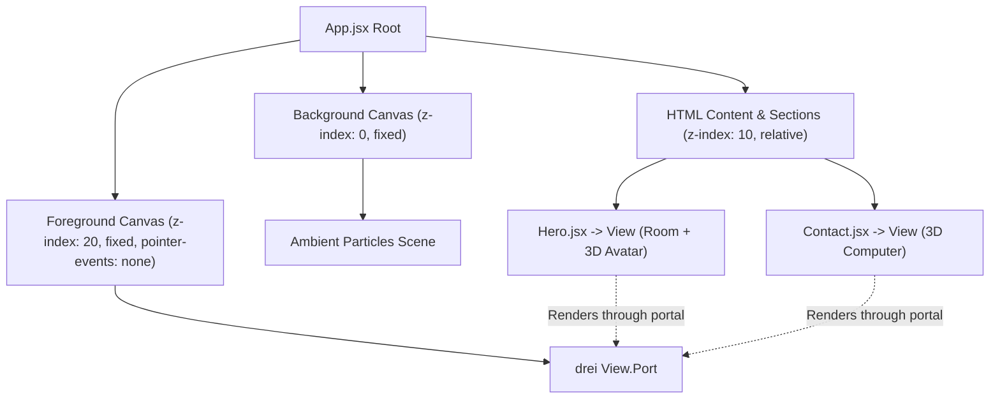
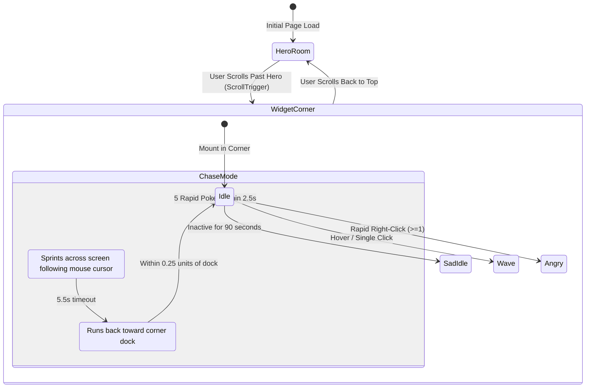

# AGENTS.md — Repository & Architecture Guide for AI Agents

Welcome, AI Agent! This document is the comprehensive single-source-of-truth for understanding, maintaining, developing, and debugging the **Shahmir Zaman Personal 3D Portfolio**.

---

## 1. Quick Project Overview

- **Project Purpose**: High-converting interactive portfolio for Shahmir Zaman, a Software & AI Integration Engineer / Intern (HFU Germany graduate based in UAE/Germany).
- **Core Philosophy**: A business + tech hybrid showcasing full-stack software, autonomous AI backends, enterprise automations, and immersive real-time 3D experiences.
- **Key Deliverables**:
  - Single-page application with smooth anchor-based section navigation.
  - Interactive 3D scenes rendered with Three.js & React Three Fiber.
  - Embedded AI assistant ("Mini-Me") powered by Google Gemini with domain-grounded knowledge and actionable UI triggers.
  - Interactive "Desktop Goose" style 3D Easter egg chase mode.
  - Detailed case studies (SmartBuild Optimization, Notery, SumAI, RoamAura).

---

## 2. Technology Stack & Tooling

| Layer | Technologies |
| :--- | :--- |
| **Framework & Core** | React 19, Vite 7 (ES Modules) |
| **Styling & Design System** | Tailwind CSS v4 (`@tailwindcss/vite`), Custom CSS (`src/index.css`), Mona Sans typography |
| **3D & WebGL Engine** | Three.js, `@react-three/fiber` (R3F), `@react-three/drei`, GLTF/GLB models |
| **Animation Engine** | GSAP 3, `@gsap/react`, `ScrollTrigger` |
| **AI Assistant Backend** | Vercel Serverless Functions (`api/chat.js`), Google Gemini API (`gemini-3.1-flash-lite`, `@google/generative-ai`) |
| **Client Form Integration** | EmailJS (`@emailjs/browser`) |
| **Build & Tooling** | ESLint 9, Terser (production dead-code elimination & minification), PostCSS |

---

## 3. Commands & Environment

```bash
# Start Vite development server (port 5173 by default)
npm run dev

# Run production build (compiles to dist/ with chunk splitting & Terser minification)
npm run build

# Preview production build locally
npm run preview

# Run ESLint over codebase
npm run lint

# Run with Vercel serverless backend locally (required for live /api/chat testing)
vercel dev
```

### Environment Variables
- `GEMINI_API_KEY`: Server-side API key for Google Gemini. Stored in `.env` / Vercel secrets. **Never** prefix with `VITE_` or expose to client bundles.

---

## 4. Repository & Directory Structure

```
.
├── api/
│   └── chat.js                     # Vercel serverless function (Gemini LLM proxy with rate limiting & prompt security)
├── public/
│   ├── images/                     # WebP optimized screenshots, logos, UI icons, avatars
│   │   ├── logos/                  # Tech & company logos (Infinix, Notery, SumAI, Roamaura, SmartBuild)
│   │   └── projects/smartbuild/    # Case study presentation slide deck (slide1..slide12.webp)
│   ├── models/                     # 3D assets (avatar-new.glb, room, computer, tech icons)
│   └── cv/                         # Downloadable PDF resume (Shahmir_Zaman_CV.pdf)
├── src/
│   ├── components/
│   │   ├── Models/
│   │   │   ├── HeroModels/         # Avatar.jsx, Room.jsx, HeroExperience.jsx, Particles.jsx, HeroLights.jsx
│   │   │   ├── contact/            # Computer.jsx, ContactExperience.jsx
│   │   │   └── TechLogos/          # 3D floating tech stack icons (TechIcon.jsx)
│   │   ├── ui/                     # UI primitives (button.jsx)
│   │   ├── AvatarWidget.jsx        # Floating 2D/3D draggable corner avatar widget & chase controller
│   │   ├── ChatPanel.jsx           # AI chat drawer interface with action button parser
│   │   ├── NavBar.jsx              # Fixed header navigation with submenus & mobile responsive drawer
│   │   ├── TimelineCard.jsx        # Standardized timeline card for experience & quickviews
│   │   └── TitleHeader.jsx         # Section title & subtitle component
│   ├── constants/
│   │   └── index.js                # SINGLE SOURCE OF TRUTH: Bio, skills, work history, projects, navigation links
│   ├── lib/
│   │   ├── avatarHints.js          # IntersectionObserver observer for contextual avatar speech bubble messages
│   │   ├── geminiService.js        # Client fetch wrapper to /api/chat with conversation history
│   │   ├── scrollToProject.js      # Smooth scroll helper with visual target flashing (.project-flash)
│   │   ├── shahmirProfile.js       # Dynamic system prompt & knowledge base generator reading from constants
│   │   └── utils.js                # Class name merger helper cn() (clsx + tailwind-merge)
│   ├── sections/
│   │   ├── Hero.jsx                # Landing hero, typography word slider, 3D room, widget trigger
│   │   ├── TechStack.jsx           # 3D tech icons grid & proficiency categories
│   │   ├── WorkExperience.jsx      # Detailed career history (Infinix Innovations Dubai internship, role summaries)
│   │   ├── ProjectQuickview.jsx    # Interactive Cyber-tabbed project cards (Web Dev vs AI & ML)
│   │   ├── ShowcaseSection.jsx     # Flagship featured projects (16:9 Notery top hero + 2-col SumAI/RoamAura)
│   │   ├── MLCaseStudy.jsx         # SmartBuild €126,520 savings ML case study presentation viewer
│   │   ├── FeatureCards.jsx        # Competency and engineering strengths cards
│   │   ├── Contact.jsx             # 3D interactive terminal computer & EmailJS message form
│   │   └── Footer.jsx              # Social links, status beacon, copyright
│   ├── App.jsx                     # Root composition & dual-canvas WebGL viewport layer
│   ├── index.css                   # Global Tailwind utilities, CSS variables, keyframe animations, glow filters
│   └── main.jsx                    # React 19 entry point
├── CLAUDE.md                       # High-level architecture notes
├── DESIGN.md                       # Strict UI design system, color palette, typography rules
├── PRODUCT.md                      # Target audience, positioning, and product requirements
└── vite.config.js                  # Manual chunk splitting, alias resolution (@ -> src/), Terser config
```

---

## 5. Architectural Deep Dive

### 5.1. Dual-Canvas 3D Layering Pattern
A common mistake in WebGL React apps is mounting multiple `<Canvas>` components, which bloats GPU memory and desynchronizes framerates. This project solves this using a **Dual-Canvas Architecture**:



- **Background Canvas (`z-index: 0`)**: Fixed fullscreen, renders ambient background particles.
- **Foreground Canvas (`z-index: 20`)**: Houses `<View.Port />` from `@react-three/drei`.
- **Individual Sections**: Declare `<View>` portals that position 3D content in the normal DOM scroll flow while utilizing the shared WebGL context.
- **Rule for Agents**: When adding new 3D models to sections, **never** create a new `<Canvas>`; portal it through `<View>`.

---

### 5.2. Avatar Assistant & "Desktop Goose" Chase Mode
The avatar component (`src/components/Models/HeroModels/Avatar.jsx`) and widget (`src/components/AvatarWidget.jsx`) represent the most complex interactive subsystem:



#### Key Kinematics & Mechanics:
1. **Dynamic Head Tracking**:
   - In `Idle`, the head and neck bones track the cursor relative to screen coordinates (`headBone` 70%, `neckBone` 30%).
   - In `Sad Idle`, head droops downward (`SAD_PITCH = 0.28`, ~16° down).
2. **Animation Loop Sanitization**:
   - Track keyframes at $t=0.0$ are prepended to eliminate Mixamo 30fps boundary stalls.
   - Three.js `PropertyMixer` is monkey-patched on head/neck bindings to guarantee `binding.setValue` applies continuously, preventing rotational snapping.
3. **Screen Boundary & Drag Physics**:
   - The avatar widget is anchored at `bottom: 24px; right: 24px;`.
   - `pos.y` is strictly constrained to **$\le 0$** (`maxY = 0`). **Under no circumstance may `pos.y` become positive**, preventing the avatar from ever being dragged below the viewport edge.
   - Dragging attaches global `window` event listeners (`pointermove`, `pointerup`, `pointercancel`) so releasing outside the widget never locks the drag state.
   - Snaps to left or right screen edge on pointer release.
4. **Chase Mode ("Desktop Goose")**:
   - 5 rapid pokes within 2.5s triggers `Run` animation (`chasePhase = 'CHASING'`).
   - Avatar rotates 360° toward cursor heading with **banking roll lean** (`targetRoll = clamp(-diff * 0.35, -0.2, 0.2)`) and **sprint pitch**.
   - After 5.5s, transitions to `'RETURNING'`, running straight back to its corner dock before smoothly resetting to `Idle`.

---

### 5.3. AI Knowledge Grounding
The AI chat assistant does not have hardcoded portfolio data. Instead:
- `src/constants/index.js` defines all content (experience, projects, skills, education, contact info).
- `src/lib/shahmirProfile.js` imports these constants and builds the markdown knowledge prompt.
- `api/chat.js` injects this knowledge base into Gemini's system instructions.
- **Rule for Agents**: Any time career history, projects, or skills are updated in `src/constants/index.js`, the AI assistant automatically acquires that knowledge without requiring any prompt edits.

---

### 5.4. Showcase & Navigation Layout
- **Hero Card (Notery)**: Top flagship card constrained to 16:9 (`aspect-video`) with clean descriptive copy and direct "View Live" & "View Code" action buttons.
- **2-Column Grid (SumAI & RoamAura)**: Positioned underneath Notery in an equal 2-column layout with 16:9 thumbnails.
- **Scroll Alignment**:
  - `#projects` encompasses the "Featured Projects" title and separator with `scroll-mt-20`.
  - Individual project cards (`#project-notery`, `#project-sumai`, `#project-roamaura`) have `scroll-mt-28` so navbar links and `scrollToProject()` anchors land with proper offset beneath the fixed navigation bar.

---

## 6. Design System Rules (Excerpt from DESIGN.md)

1. **The One Aurora Rule**:
   - The primary accent color is **Beacon Blue (`#62e0ff`)**.
   - Backgrounds are strictly **Void Black (`#000000`)** and **Surface Deep (`#0e0e10`)**.
   - Surfaces/Cards use **Surface Raised (`#282732`)** with subtle borders (`rgba(255, 255, 255, 0.05)`).
2. **The Green Means Money Rule**:
   - **Impact Green (`#22c55e`)** is strictly reserved for quantified business value (e.g., the SmartBuild `€126,520` figure). Never use green for status confirmations, tags, or decorative buttons.
3. **Aspect Ratio Rule**:
   - All project cards in `ShowcaseSection.jsx` must maintain a strict 16:9 (`aspect-video`) media ratio.

---

## 7. Critical Agent Guidelines & Rules of Engagement

1. **Skill Discovery**: Automatically look through available skills before undertaking complex tasks.
2. **Brainstorming First**: For any new feature or substantial architectural change, think through requirements and user intent prior to implementation.
3. **Hook Ordering (Temporal Dead Zone - TDZ)**:
   - Always declare all `useRef`, `useState`, and `useCallback` helper functions (e.g., `getBounds`) at the **very top** of component functions before any `useEffect` or `useGSAP` hooks that reference them.
4. **Verification Before Completion**:
   - Always run `npm run build` after editing components to verify there are no JSX, import, or build issues.
   - For UI or animation changes, verify layout, bounds, and rendering using browser checks or automated scripts.
5. **No Regressions on Avatar Bounds**:
   - Never allow `pos.current.y > 0` in `AvatarWidget.jsx`. The bottom dock is `maxY = 0`.
6. **Documentation Integrity**:
   - Keep `src/constants/index.js` clean, factual, and strictly truthful to Shahmir's real-world credentials and projects.
