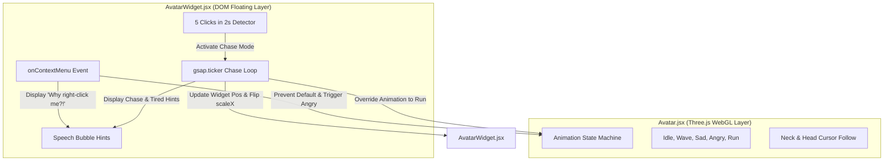

# Avatar Interactive Behaviors & Chase Easter Egg Implementation Plan

> **For agentic workers:** REQUIRED SUB-SKILL: Use superpowers:subagent-driven-development to implement this plan task-by-task. Steps use checkbox (`- [ ]`) syntax for tracking.

**Goal:** Add interactive avatar reactions including wake from Sad to Idle on hover/right-click, an Angry reaction on widget right-click, and a playful 6-second cursor-chase easter egg when clicked 5 times within 2 seconds.

**Architecture:** Extend `Avatar.jsx`'s animation state machine to integrate the baked `Angry` and `Run` clips from `avatar-new.glb`. Connect interaction events in `AvatarWidget.jsx` through a sliding-window click tracker and a `gsap.ticker`-driven physics loop that chases mouse coordinates across the screen.

**Architecture Diagram:**

**Tech Stack:** React 19, `@react-three/fiber`, `@react-three/drei`, GSAP 3.13, Three.js 0.160

---

### Task 1: Extend Animation State Machine in `Avatar.jsx`

**Files:**
- Modify: [`src/components/Models/HeroModels/Avatar.jsx`](file:///C:/Users/sawee/Desktop/Personal%20Projects/WEB%20DEV/Major%20Project/Main%20Website/src/components/Models/HeroModels/Avatar.jsx)

- [ ] **Step 1: Add Angry and Run clips to `CLIP_FOR_STATE`**
  Map `'Angry': 'Angry'` and `'Run': 'Run'` in `CLIP_FOR_STATE`.
  
- [ ] **Step 2: Add `forcedAnimation` prop and state sync**
  Accept `forcedAnimation` in `Avatar({ isHero, isWidget, isChatOpen, forcedAnimation, onClick, onContextMenu, ...props })` so the parent widget can trigger `Angry` and `Run`.

- [ ] **Step 3: Configure loop modes for `Angry` and `Run`**
  In the animation configuration block:
  - `Angry`: `LoopOnce`, `clampWhenFinished = true`, 0.3s crossfade, auto-return to `Idle` on finished.
  - `Run`: `LoopRepeat, Infinity`, `timeScale = 1.25`, 0.25s crossfade.

- [ ] **Step 4: Update hover and right-click handlers**
  Update `handleHover` so if `animationName === 'Sad Idle'`, it transitions directly to `Idle`.
  Add `handleContextMenu` to catch right-clicks on the 3D scene and transition `Sad Idle` to `Idle`.

- [ ] **Step 5: Verify build**
  Run: `npm run build`
  Expected: Clean build without errors.

---

### Task 2: Implement Click-Rage Tracker & Right-Click Reaction in `AvatarWidget.jsx`

**Files:**
- Modify: [`src/components/AvatarWidget.jsx`](file:///C:/Users/sawee/Desktop/Personal%20Projects/WEB%20DEV/Major%20Project/Main%20Website/src/components/AvatarWidget.jsx)

- [ ] **Step 1: Add right-click handler (`onContextMenu`)**
  Intercept right clicks on the widget:
  - Call `e.preventDefault()` to block browser menu.
  - Set `forcedAnimation = 'Angry'`.
  - Set temporary speech bubble: `"Hey! Why did you right-click me?! 😠"`.
  - Set 3.5s timeout to reset `forcedAnimation = null` and clear bubble.

- [ ] **Step 2: Add 5-click / 2-second rage detection**
  In `handleWidgetClick`:
  - Track array of recent click timestamps `clickTimes.current`.
  - Filter clicks within the last 2000ms.
  - When `clickTimes.current.length >= 5`, trigger `startChaseMode()`.

- [ ] **Step 3: Implement Chase Mode Physics Loop**
  In `startChaseMode()`:
  - Set `isChasing = true`.
  - Set `forcedAnimation = 'Run'`.
  - Set speech bubble: `"THAT'S IT! I'M COMING FOR YOU! 🏃💨"`.
  - Add `gsap.ticker` listener tracking `window.pointer` / `globalMouse`.
  - In each tick: calculate vector `(targetX - currentX, targetY - currentY)`.
  - Translate widget with interpolation speed `0.08`.
  - Apply `transform: translate(...) scaleX(facingLeft ? -1 : 1)`.

- [ ] **Step 4: Implement Chase Cooldown & Edge Snap-Back**
  After 6000ms:
  - Stop `gsap.ticker`.
  - Set `isChasing = false`.
  - Set speech bubble: `"Phew... okay, stop poking me! 😮‍💨"` for 3 seconds.
  - Clear `forcedAnimation` to return to `Idle`.
  - Trigger GSAP spring tween to snap back to the nearest screen edge.
  - Reset click history.

- [ ] **Step 5: Verify build & end-to-end integration**
  Run: `npm run build`
  Expected: Clean build without errors.
