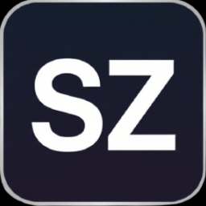

<div id="top">

<div align="center">


# Personal Website

<em>Built with the tools and technologies:</em>


</div>

---

## Table of Contents

- [Overview](#overview)
- [Features](#features)
- [Project Structure](#project-structure)
- [Getting Started](#getting-started)
- [License](#license)

---

## Overview

A personal portfolio website built as a React single-page application, featuring interactive 3D scenes, scroll-driven animations, and a working contact form.

---

## Features

| | Component | Details |
| :--- | :--- | :--- |
| ⚙️ | **Architecture** | <ul><li>React 18 + Vite 5 as the core SPA framework</li><li>Three.js & @react-three/fiber for WebGL scenes (GLB assets)</li><li>Tailwind CSS + Tailwind Merge for utility-first styling</li><li>Modular hierarchy: pages → sections → UI primitives</li></ul> |
| 🔩 | **Code Quality** | <ul><li>ESLint with `eslint-plugin-react-hooks` and `eslint-plugin-react-refresh`</li><li>TypeScript typings via `@types/react`, `@types/react-dom`, `@types/node`</li><li>PascalCase for components, kebab-case for assets</li></ul> |
| 🔌 | **Integrations** | <ul><li>`emailjs` — client-side email service</li><li>`gsap` / `@gsap/react` — animation engine</li><li>`@splinetool/runtime`, `@splinetool/react-spline` — 3D asset loading</li><li>`lucide-react` — icon library</li><li>`react-responsive` — media query hooks</li></ul> |

---

## Project Structure

```sh
└── Main Website/
    ├── components.json
    ├── eslint.config.js
    ├── index.html
    ├── jsconfig.json
    ├── package.json
    ├── package-lock.json
    ├── public/
    │   ├── cv/
    │   ├── favicon.png
    │   ├── images/
    │   └── models/
    ├── src/
    │   ├── App.jsx
    │   ├── main.jsx
    │   ├── index.css
    │   ├── components/
    │   │   ├── Button.jsx
    │   │   ├── ExpContent.jsx
    │   │   ├── NavBar.jsx
    │   │   ├── TitleHeader.jsx
    │   │   ├── ui/
    │   │   └── Models/
    │   │       ├── contact/
    │   │       ├── HeroModels/
    │   │       └── TechLogos/
    │   ├── constants/
    │   ├── lib/
    │   └── sections/
    │       ├── Hero.jsx
    │       ├── TechStack.jsx
    │       ├── Experience.jsx
    │       ├── ShowcaseSection.jsx
    │       ├── FeatureCards.jsx
    │       ├── LogoSection.jsx
    │       ├── Contact.jsx
    │       └── Footer.jsx
    ├── vite.config.js
    └── README.md
```

---

## Getting Started

**Prerequisites:** Node.js and npm.

```sh
# Clone the repository
git clone <repo-url>

# Navigate to the project directory
cd "Main Website"

# Install dependencies
npm install

# Start the dev server
npm run dev
```

Other scripts:

```sh
npm run build     # production build
npm run preview   # preview the production build
npm run lint      # run ESLint
```

---

## License

Personal Website is released under the [LICENSE](https://choosealicense.com/licenses/) file in this repository.

<div align="right">

[![][back-to-top]](#top)

</div>

[back-to-top]: https://img.shields.io/badge/-BACK_TO_TOP-151515?style=flat-square
